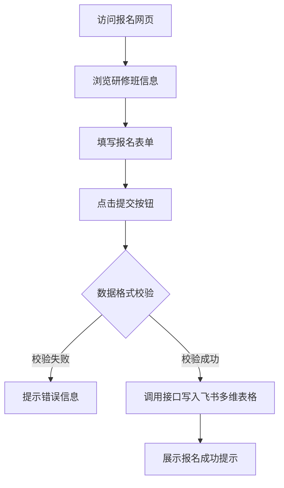

## 1. 产品概述
一个精美、现代化的企业家研修报名系统网页，呈现一套详细的调查问卷并收集报名者的信息。
- 目标用户是希望报名参加“浙江大学企业家研修班”的企业高管、创始人。
- 主要解决报名信息的高效收集，并将数据无缝传输至指定的飞书多维表格中。
- 提供高端、大气的视觉体验，体现研修班的专业性与尊贵感。

## 2. 核心功能

### 2.1 角色权限
| 角色 | 注册方式 | 核心权限 |
|------|----------|----------|
| 访客 | 无需注册 | 浏览网页内容、填写并提交报名表单 |

### 2.2 功能模块
1. **首页**: 英雄大图区域（展示研修班主题）、课程特色介绍、讲师阵容。
2. **报名表单页**: 详细的调查问卷表单（包含姓名、手机、公司名称、职务、行业、规模等信息）。
3. **提交成功反馈**: 提交成功后的弹窗或页面提示，告知用户后续流程。

### 2.3 页面详情
| 页面名称 | 模块名称 | 功能描述 |
|----------|----------|----------|
| 首页 | 英雄区域 | 动态背景或轮播图，突出展示“浙江大学企业家研修班”主题及核心标语。 |
| 首页 | 课程亮点 | 采用卡片式设计展示课程的特色、学制和收益。 |
| 报名表单 | 信息采集 | 提供表单项：姓名、性别、手机号、邮箱、公司名称、担任职务、所属行业、公司规模、推荐渠道。表单带基本校验（必填、手机号格式等）。 |
| 报名表单 | 数据提交 | 提交按钮，点击后触发 API 调用，将数据传输至飞书多维表格。 |

## 3. 核心流程
用户通过报名链接进入网页 -> 浏览课程信息 -> 填写报名表单 -> 提交表单 -> 收到提交成功的反馈。

## 4. 用户界面设计

### 4.1 设计风格
- 主色调：浙大蓝（#003F87）和尊贵金（#D4AF37）。
- 按钮风格：圆角按钮，带微小的阴影和悬浮动效（体现现代感与精致感）。
- 字体：使用优雅的黑体/无衬线字体（如 Noto Sans SC, PingFang SC），标题可加粗以突出重点。
- 布局风格：极简且大气的卡片式布局，表单采用单列居中，留白充足（体现高端感）。

### 4.2 页面设计概览
| 页面名称 | 模块名称 | UI元素 |
|----------|----------|--------|
| 首页 | 顶部导航 | 浙大/研修班Logo，透明背景，随滚动渐变。 |
| 首页 | 英雄区域 | 全屏高度，深蓝色背景配合金色渐变或建筑线框图作为底纹，居中大标题和“立即报名”按钮。 |
| 报名表单 | 表单卡片 | 白色背景卡片，带有柔和的投影，浮在背景之上。输入框采用下划线样式或带浅灰背景的圆角矩形。 |

### 4.3 响应式设计
- 优先适配移动端（考虑到大部分高管可能通过微信分享链接在手机上打开），同时完美适配桌面端。
- 触摸优化：输入框和下拉框的点击区域放大，方便手机操作。
