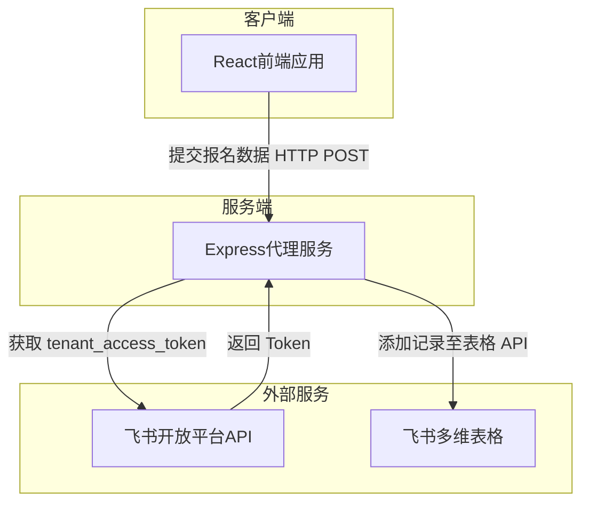

## 1. 架构设计


## 2. 技术说明
- 前端框架: React@18 + tailwindcss@3 + vite
- 后端框架: Express.js (使用 TypeScript)
- 状态管理: zustand
- 路由管理: react-router-dom
- 初始化工具: vite-init
- 模板选择: react-express-ts

## 3. 路由定义
| 路由 | 目的 |
|-------|---------|
| / | 首页，展示研修班介绍及入口 |
| /register | 报名表单页，填写并提交信息 |
| /success | 报名成功提示页 |

## 4. API 定义 (如果有后端存在)
### 4.1 提交报名信息接口
- **路径**: `/api/register`
- **方法**: `POST`
- **请求体 (Request Body)**:
```typescript
interface RegisterPayload {
  name: string;        // 姓名
  gender: string;      // 性别 (男/女)
  phone: string;       // 手机号码
  email: string;       // 邮箱
  company: string;     // 公司名称
  title: string;       // 担任职务
  industry: string;    // 所属行业
  scale: string;       // 公司规模
  channel: string;     // 推荐渠道
  remarks?: string;    // 备注
}
```
- **响应体 (Response Body)**:
```typescript
interface RegisterResponse {
  success: boolean;
  message: string;
  data?: any;
}
```

## 5. 服务端架构图


## 6. 数据模型 (由于数据存储在飞书，此处为飞书表格字段映射)
### 6.1 字段映射表
| 表单字段 | 飞书表格字段名 | 字段类型 |
|----------|----------------|----------|
| 姓名 | 姓名 | 文本 |
| 性别 | 性别 | 单选 |
| 手机号 | 手机号 | 文本/电话号码 |
| 邮箱 | 邮箱 | 文本/邮箱 |
| 公司名称 | 公司名称 | 文本 |
| 担任职务 | 担任职务 | 文本 |
| 所属行业 | 所属行业 | 单选/文本 |
| 公司规模 | 公司规模 | 单选/文本 |
| 推荐渠道 | 推荐渠道 | 文本 |
| 备注 | 备注 | 文本 |
